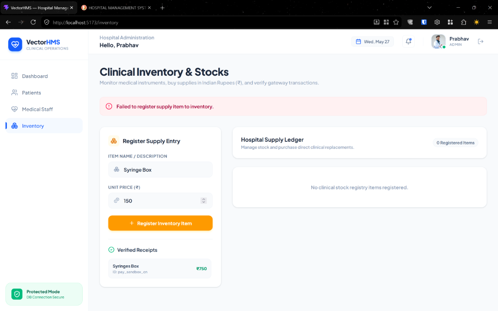
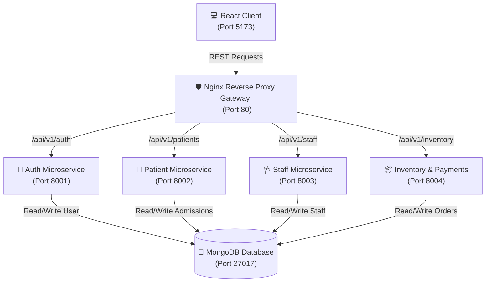

# VectorHMS: Vector Hospital Management System
A production-grade, highly responsive, and robust **Microservices-driven Clinical Operations Platform** orchestrating patient rosters, staff credentials, pricing-transparent inventory checkouts, and centralized gateway reverse-proxy networks.



---

## 🚀 Core Features & Operational Pillars

### 1. Decoupled Microservices Architecture
VectorHMS breaks away from complex, fragile monolithic patterns to deliver high fault tolerance and scalable clinical databases:
* **Fault Isolation**: Outages in the billing and payments pipeline do not affect active medical registries, keeping patient admission functions online.
* **Autonomous Services**: Each backend service (Auth, Patient, Staff, Inventory) operates independently in isolated Docker containers with independent PyMongo adapters and databases.
* **Stateless Token Authorization**: Employs industry-standard **JSON Web Tokens (JWT)** generated via cryptographic `bcrypt` hashing configurations for secure user sessions.

### 2. Reactive Case Allocation (Patient-Staff Care Loop)
Enables immediate real-time coordination between clinicians and active medical cases:
* **Auto-admissions**: Newly registered patients are stored in MongoDB with their care- clinician references initialized to `null`, instantly appearing in the "Unassigned Admissions" ledger.
* **Roster Syncing**: Admin staff choose active personnel and assign them cases via dynamic dropdown pickers in the Staff directory.
* **Instant Handshakes**: Updates patient profiles recursively, auto-filtering them from the unassigned ledger and listing them securely under the care-clinician's active profile.
* **Roster Releases**: Releasing a patient from care automatically resets the database pointer, returning them to the global unassigned roster instantly.

### 3. Transparent Supply Ledger & Secure Checkout
Features clear explicit pricing, reactive quantity checkout scaling, and secure sandbox payment validation:
* **Explicit Pricing**: Set exact unit prices (₹) when registering stock items (e.g. Sterile Syringes at ₹150). If left blank, the system dynamically estimates prices using keyword recognition.
* **Quantity Selectors**: Scale item counts up/down via reactive counters `[ - ] Qty [ + ]` next to purchase actions.
* **Audit-Compliant Invoicing**: Transmits transactions under specific ledger labels (`"{Quantity}x {ItemName}"`) and computes total checkout amounts recursively (`Amount = Unit Price * Quantity`).
* **Sandbox Simulators**: Provides a robust mockup payment interface for test credentials, verifying cryptographic signatures and outputting confirmed receipts directly to the MongoDB billing history logs. Serves full integration guides for **Razorpay Gateway** test mode in `razorpay_setup.md`.

### 4. Route Catalog & Interactive Swagger Docs
Exposes direct route directories and automated sandbox APIs natively through the reverse proxy:
* **API Route Directory**: Accessing the root gateway address at `http://localhost/` returns a complete JSON listing of all microservices, their path prefixes, and endpoint actions.
* **Interactive Swagger UIs**: Every FastAPI microservice hosts self-documenting Swagger OpenAPI dashboards mapped securely under their proxy prefixes, allowing developers to execute live REST requests directly from the browser:
  * 🔑 **Auth Service Docs**: `http://localhost/api/v1/auth/docs`
  * 🏥 **Patient Service Docs**: `http://localhost/api/v1/patients/docs`
  * 🩺 **Staff Service Docs**: `http://localhost/api/v1/staff/docs`
  * 📦 **Inventory & Razorpay Docs**: `http://localhost/api/v1/inventory/docs`

---

## 🛠️ Technology Stack Specification

| Component | Technology | Version | Purpose |
| :--- | :--- | :---: | :--- |
| **Frontend UI** | **React** | `19.2.6` | Client architecture & live state rendering |
| **Bundling** | **Vite** | `8.0.12` | Hot Module Replacement (HMR) bundler |
| **Styling** | **Tailwind CSS** | `4.3.0` | Responsive utility grids & layout styling |
| **Animations** | **Framer Motion** | `12.39.0` | Smooth UI animations & modal transitions |
| **Icons** | **Lucide React** | `1.16.0` | High-fidelity clinical iconography |
| **API Client** | **Axios** | `1.16.1` | Clean promise-based REST communication |
| **Charts** | **Recharts** | `3.8.1` | Animated operational graphs & analytics |
| **Backend REST** | **FastAPI** | `0.110.0` | Asynchronous high-performance REST APIs |
| **ASGI Server** | **Uvicorn** | `0.28.0` | Light and fast asynchronous ASGI web server |
| **Validation** | **Pydantic** | `2.6.4` | Strict structural data parsing and typing |
| **DB Driver** | **PyMongo** | `4.6.2` | MongoDB client connection pooling |
| **Cryptographics** | **bcrypt** | `4.0.1` | Cryptographic password hashing & salts |
| **JWT Tokens** | **PyJWT** | `2.8.0` | Stateless session token handling |
| **Payment Gateway**| **Razorpay** | `1.3.0` | Payment API and checkout validation |
| **Gateway Proxy** | **Nginx** | `Alpine` | Secure route handling & CORS headers proxy |
| **Database** | **MongoDB** | `Latest` | Scalable BSON document data storage |

---

## 🗺️ Architectural Topology Diagram



---

## 🚀 Setup & Launch Instructions (From Scratch)

Follow these step-by-step instructions to pull up the complete microservices cluster and the client application:

### ⚙️ Prerequisites
Ensure you have the following software installed locally:
* **Docker Desktop** (with Docker Compose v2)
* **Node.js** (v18 or higher)
* **Git**

---

### Step 1: Clone the Project Repository
```bash
git clone https://github.com/Seplestr/hospital-management-system.git
cd "Hospital Management System"
```

### Step 2: Configure Environment Variables (`.env`)
Create a `.env` file in the root project directory (alongside `docker-compose.yml`) containing:
```env
MONGO_URL=mongodb://mongo:27017/hospital_db
JWT_SECRET=vector_hms_super_secret_signing_key_change_me
JWT_ALGORITHM=HS256
ACCESS_TOKEN_EXPIRE_MINUTES=120

# Razorpay sandbox test credentials (Optional - default triggers secure simulator overlay)
RAZORPAY_KEY_ID=rzp_test_mockKeyId123
RAZORPAY_KEY_SECRET=mockKeySecretSecret123
```

### Step 3: Run the Microservices Docker Cluster
Fire up the backend microservices, Nginx API Gateway, and MongoDB database inside Docker:
```bash
docker compose up -d --build
```
This command compiles individual container images using alpine packages, maps public gateway port `80`, and mounts persistent MongoDB volumes globally.

Verify that all 6 containers are running healthy:
```bash
docker compose ps
```

### Step 4: Run the React Client Application
Navigate to the frontend folder, install dependencies, and launch Vite's Hot Module Replacement (HMR) local development server:
```bash
cd frontend
npm install
npm run dev
```

### Step 5: Explore the Application
Open your web browser and navigate to:
* 🌐 **Frontend Client Dashboard**: `http://localhost:5173`
* 🛡️ **Nginx API Directory Homepage**: `http://localhost/`
* 📑 **Interactive Swagger Documentations**:
  * [Auth Microservice Docs](http://localhost/api/v1/auth/docs)
  * [Patient Microservice Docs](http://localhost/api/v1/patients/docs)
  * [Staff Microservice Docs](http://localhost/api/v1/staff/docs)
  * [Inventory Microservice Docs](http://localhost/api/v1/inventory/docs)