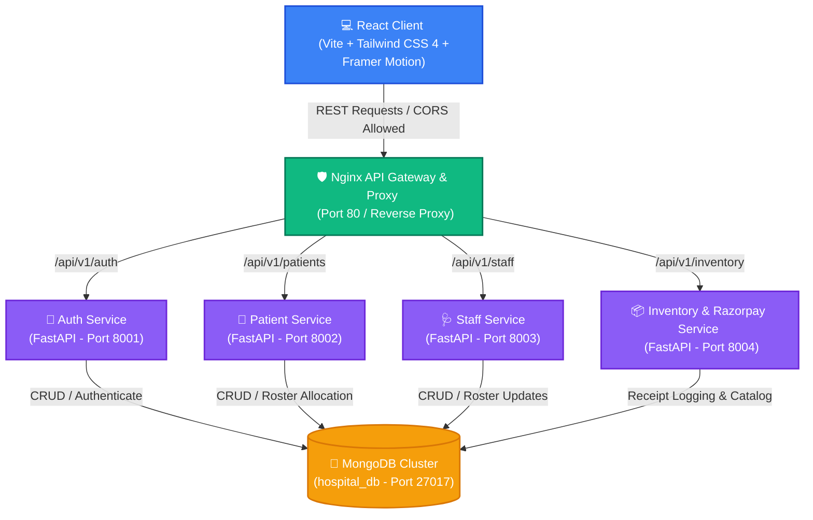
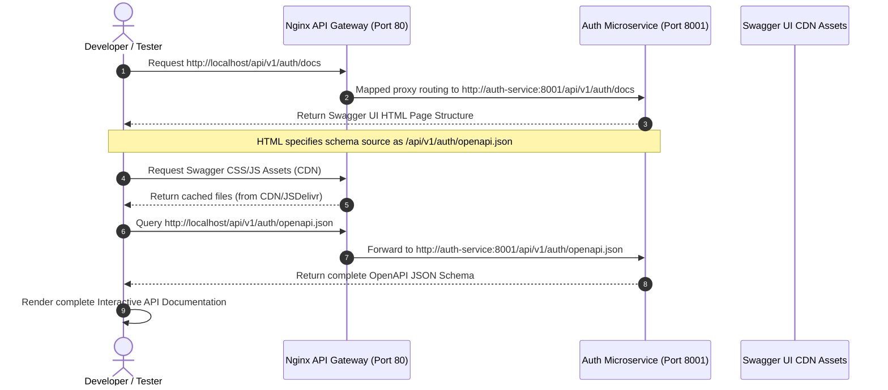

# VectorHMS: Technical Whitepaper & Architectural Reference Guide
An in-depth guide to the design, architecture, libraries, and integration logic powering the **Vector Hospital Management System (VectorHMS)**.

---

## 🌟 Executive Summary & Design Philosophy
**VectorHMS** is a production-grade, highly responsive, and robust **Microservices-driven Clinical Operations Platform**. Designed for modern healthcare infrastructure, the platform handles mission-critical medical rosters, staff credentials management, pricing-transparent inventory acquisition, and patient admission ledgers.

Unlike traditional, monolithic systems—which suffer from single-points-of-failure, scalability bottlenecks, and complex upgrade cycles—VectorHMS is engineered around a **decoupled microservices architecture** orchestrated via **Docker Containers**, securely routed through an **Nginx API Gateway**, and styled using an ultra-modern React interface.

### 🛡️ Why Microservices in Healthcare?
1. **Fault Isolation**: If the *Inventory & Payments Service* fails due to an external gateway outage, the *Patient Registry* and *Staff Allocation Roster* continue operating uninterrupted, ensuring patient care remains unhindered.
2. **Scalability**: The *Auth Service* handles heavy authentication traffic during shift changes. In production, we can scale just the Auth service container up to 10 instances without wasting resources scaling the rest of the app.
3. **Database Autonomy**: While they currently share a high-performance MongoDB instance, each service maintains isolated database client instances and collections, facilitating easy migration to separate dedicated databases as the hospital grows.
4. **Independent Deployability**: Developers can deploy a patch to the inventory validation logic without restarting or redeploying the active rosters services.

---

## 🗺️ High-Level System Architecture

The blueprint below represents the end-to-end data lifecycle in **VectorHMS**, starting from the client browser down to the database layers:



---

## 🧱 Detailed Service Specifications & Technology Stack

VectorHMS uses a curated, modern developer stack optimized for high runtime speeds, strict data typing, and responsive fluid styling:

### ⚙️ Backend Technology Stack

Each backend service is created in **Python** using the **FastAPI** framework, chosen for its asynchronous execution speeds, automated Swagger documentation, and integrated **Pydantic** validation system.

| Library / Tool | Version | Primary Purpose in VectorHMS | Technical Rationale & Impact |
| :--- | :---: | :--- | :--- |
| **FastAPI** | `0.110.0` | Core Asynchronous REST API framework. | Offers blazing-fast execution speeds (benchmarked with Go and NodeJS) using Python's `async/await`. Out-of-the-box OpenAPI schema generation allows easy testing at `/docs`. |
| **Uvicorn** | `0.28.0` | Lightning-fast ASGI Server | Operates as the underlying HTTP server supporting async loop implementations, keeping memory usage minimal under concurrent clinical traffic. |
| **Pydantic** | `2.6.4` | Data Parsing, Typing, & Validation | Enforces strict schemas for client payloads (e.g. email checks, exact decimal definitions). Rejects bad data payloads before database execution, avoiding corrupted entries. |
| **PyMongo** | `4.6.2` | MongoDB Native Driver | Enables object-relational mapping and database interactions via efficient BSON connection pooling, optimizing indexing commands. |
| **PyJWT** | `2.8.0` | Cryptographic JWT Token Handler | Generates and decodes JSON Web Tokens (JWT) for secure, stateless user sessions using secure HS256 hashing parameters. |
| **bcrypt** | `4.0.1` | Cryptographic Salt & Password Hashing | Secures staff password hashes in the database using strong, computationally heavy salt parameters to defend against brute-force attacks. |
| **Razorpay SDK** | `1.3.0` | Payment Gateway Integration | Handles secure billing pipelines, order registration, and verifies digital payment signatures. |
| **python-dotenv** | `1.0.1` | Local Environment Manager | Parses variable bindings from the local `.env` configuration template cleanly into python processes. |

---

### 🎨 Frontend Technology Stack

The client interface is designed to deliver a modern, premium **dashboard experience** utilizing micro-interactions, responsive sizing, and animated clinical states.

| Library / Tool | Version | Primary Purpose in VectorHMS | Technical Rationale & Impact |
| :--- | :--- | :--- | :--- |
| **React** | `19.2.6` | Component Architecture & UI | Leverages React 19’s optimized rendering cycle to update dashboards, tables, and modal components cleanly. |
| **Vite** | `8.0.12` | Ultra-fast HMR Bundling Tool | Replaces legacy Webpack configs, delivering sub-millisecond Hot Module Replacement (HMR) speeds, resulting in lightning-fast development feedback. |
| **Tailwind CSS 4** | `4.3.0` | Modern Utility Styling | Enables responsive layouts, curated modern color systems, glassmorphism, and dark mode triggers directly inside HTML structures. |
| **Framer Motion** | `12.39.0` | Fluid Micro-animations | Powers smooth, interactive visual transitions, table row removals, and checkout modal entry/exit paths. |
| **Lucide React** | `1.16.0` | SVG Visual Icon Suite | Delivers clean, consistent, high-fidelity clinical icons across all pages. |
| **Axios** | `1.16.1` | Clean HTTP Client | Manages REST requests with Nginx, allowing structured request/response interceptors and automated JSON serialization. |
| **Recharts** | `3.8.1` | Dynamic Operational Charts | Renders sleek, animated charts in the chief dashboard showing current expenses, active cases, and inventory levels. |

---

## 🔁 Critical Flow & Integration Engine

VectorHMS introduces two customized structural workflows designed to solve complex data synchronization problems:

### 1. The Reactive Case Allocation Engine (Patient-Staff Care Loop)
Managing patient admissions and personnel rosters is typically a multi-step operation. In VectorHMS, this is synchronized reactively:
* **Initial State**: Patients are registered in the system with their assigned staff fields initialized to `null`. They automatically appear on the "Unassigned" roster in the Patients page.
* **Roster Assignment**: Through the Staff page, administrators click **"Assign Case"** next to a staff member. The UI queries the database for all patients where `assigned_staff_id == null`.
* **Database Synchronization**: Upon choosing a patient and submitting the assignment, a PUT request triggers the *Patient Service* to update the patient's record in MongoDB.
* **Auto-Removal**: The patient is dynamically filtered out of the active "Unassigned" rosters and appears under the "Under Active Care" badge of the chosen clinician.
* **Release Trigger**: Clicking **"Release"** next to a patient instantly removes the binding, returning the patient back to the "Unassigned" registry list.

```mermaid
sequenceDiagram
    autonumber
    actor Admin as Hospital Administrator
    participant Client as React Dashboard
    participant Nginx as Nginx API Gateway
    participant StaffService as Staff Service
    participant PatientService as Patient Service
    participant DB as MongoDB Cluster

    Admin->>Client: Open Staff Directory
    Client->>Nginx: GET /api/v1/patients
    Nginx->>PatientService: GET /api/v1/patients
    PatientService->>DB: Query {assigned_staff_id: null}
    DB-->>PatientService: Return Unassigned Patients List
    PatientService-->>Client: Unassigned Patient List
    Admin->>Client: Choose Patient "Jane Doe" & Click "Assign Case" to "Dr. Chen"
    Client->>Nginx: PUT /api/v1/patients/{jane_doe_id}/assign
    Note over Client, Nginx: Payload: {staff_id: 1, staff_name: "Dr. Chen"}
    Nginx->>PatientService: PUT /api/v1/patients/{jane_doe_id}/assign
    PatientService->>DB: Update patient set {assigned_staff_id: 1, staff_name: "Dr. Chen"}
    DB-->>PatientService: Acknowledge Update Success
    PatientService-->>Client: Return 200 OK
    Client->>Client: React state updates; Jane Doe is removed from "Unassigned" Roster
    Admin->>Client: Click "Release Case" under Dr. Chen
    Client->>Nginx: PUT /api/v1/patients/{jane_doe_id}/unassign
    Nginx->>PatientService: PUT /api/v1/patients/{jane_doe_id}/unassign
    PatientService->>DB: Update patient set {assigned_staff_id: null, staff_name: null}
    DB-->>PatientService: Acknowledge Update Success
    PatientService-->>Client: Return 200 OK
    Client->>Client: State updates; Jane Doe reappears on the "Unassigned" Patients registry
```

---

### 2. Transparent Supply Ledger & Secure Checkout Engine
To prevent billing fraud and optimize supply-chain audits, VectorHMS implements explicit unit pricing coupled with automated sandbox payment checkout:

```mermaid
sequenceDiagram
    autonumber
    actor Admin as Admin / Buyer
    participant UI as React Client
    participant Proxy as Nginx API Gateway
    participant Inv as Inventory Service
    participant RP as Razorpay API / Sandbox
    participant DB as MongoDB Cluster

    Admin->>UI: Enter Item "Suture Pack", Price "₹120" & Click Register
    UI->>Proxy: POST /api/v1/inventory (price: 120)
    Proxy->>Inv: POST /api/v1/inventory (price: 120)
    Inv->>DB: Insert document in "inventory" collection
    Note over Inv, DB: Fix: Pops the generated "_id" (ObjectId) to prevent serialization errors.
    DB-->>Inv: Saved successfully
    Inv-->>UI: Return 200 OK with Item JSON
    Admin->>UI: Select quantity to "5" (Subtotal = ₹600)
    Admin->>UI: Click "Buy Stock"
    UI->>Proxy: POST /api/v1/inventory/order/create
    Note over UI, Proxy: Payload: {item_name: "5x Suture Pack", amount: 600}
    Proxy->>Inv: POST /api/v1/inventory/order/create
    Inv->>RP: Create Razorpay Order
    RP-->>Inv: Return Order ID (e.g., order_mock_abc123)
    Inv->>DB: Save pending transaction in "orders" collection
    Inv-->>UI: Return Order ID + Razorpay Public Key
    UI->>UI: Initialize checkout modal (Mock Overlay or Real SDK)
    Admin->>UI: Complete Simulated sandbox payment successfully
    UI->>Proxy: POST /api/v1/inventory/order/verify
    Note over UI, Proxy: Payload: {order_id, payment_id, signature}
    Proxy->>Inv: POST /api/v1/inventory/order/verify
    Inv->>Inv: Cryptographically verify digital signature
    Inv->>DB: Update order status to "paid" in "orders" collection
    Inv-->>UI: Success confirmation
    UI->>UI: Dynamic reload; "5x Suture Pack - ₹600" is added to verified ledger list
```

---

## 🧭 Mapped API Directory & Interactive Swagger Docs

To make this architecture highly accessible, debuggable, and transparent, VectorHMS features a **Centralized API Directory** and **Interactive Swagger UI Documentation** fully exposed through the Nginx Reverse Proxy.

### 🌐 1. Mapped Gateway Routes Directory
Visiting the Nginx Gateway root path directly at **`http://localhost/`** provides an instantaneous, complete JSON directory cataloging all active microservice routes:

```json
{
  "message": "VectorHMS Reverse Proxy API Gateway Active",
  "system": "Vector Hospital Management System",
  "version": "1.0.0",
  "endpoints": {
    "auth_service": {
      "prefix": "/api/v1/auth",
      "routes": {
        "GET /api/v1/auth": "Retrieve status & metadata",
        "POST /api/v1/auth/register": "Register staff credentials & get access token",
        "POST /api/v1/auth/login": "Authenticate credentials & get access token",
        "GET /api/v1/auth/verify": "Validate user session state via JWT Header"
      }
    },
    "patient_service": {
      "prefix": "/api/v1/patients",
      "routes": {
        "GET /api/v1/patients": "List all registered patient admissions",
        "POST /api/v1/patients": "Register a new clinical admission",
        "PUT /api/v1/patients/{patient_id}/assign": "Assign patient case to staff member",
        "PUT /api/v1/patients/{patient_id}/unassign": "Release/unassign patient from staff care roster",
        "DELETE /api/v1/patients/{patient_id}": "Discharge patient and remove admission profile"
      }
    },
    "staff_service": {
      "prefix": "/api/v1/staff",
      "routes": {
        "GET /api/v1/staff": "Retrieve entire medical staff directory",
        "POST /api/v1/staff": "Register/enroll new personnel profile",
        "DELETE /api/v1/staff/{staff_id}": "De-register / remove personnel from credentials"
      }
    },
    "inventory_service": {
      "prefix": "/api/v1/inventory",
      "routes": {
        "GET /api/v1/inventory": "List active stocks & instruments catalog",
        "POST /api/v1/inventory": "Register a new supply item in ledger",
        "DELETE /api/v1/inventory/{item_name}": "Remove supply item from ledger",
        "POST /api/v1/inventory/order/create": "Generate Razorpay Order ID for supply purchase",
        "POST /api/v1/inventory/order/verify": "Verify signature and record successful checkout",
        "GET /api/v1/inventory/orders": "Retrieve verified paid ledger log history"
      }
    }
  }
}
```

---

### ⚡ 2. Interactive Swagger UI Docs Routing (How it works under Nginx)
By mapping `docs_url` and `openapi_url` dynamically inside each microservice initialization code to route matching their path prefix, developers can view interactive Swagger UI consoles live in the browser through Nginx:

* 🔑 **Auth Service Docs**: [http://localhost/api/v1/auth/docs](http://localhost/api/v1/auth/docs)
* 🏥 **Patient Service Docs**: [http://localhost/api/v1/patients/docs](http://localhost/api/v1/patients/docs)
* 🩺 **Staff Service Docs**: [http://localhost/api/v1/staff/docs](http://localhost/api/v1/staff/docs)
* 📦 **Inventory Service Docs**: [http://localhost/api/v1/inventory/docs](http://localhost/api/v1/inventory/docs)



---

## 📦 Containerization & Configuration Architecture

The entire stack is configured via `docker-compose.yml` to spin up a developer sandbox in a single terminal command. Here is an overview of the service parameters:

1. **`mongo` container**:
   * **Base Image**: `mongo:latest`
   * **Database Port**: `27017:27017`
   * **Persistence**: Binds container data path `/data/db` to a Docker volume `mongo-data` to prevent data loss when container instances recycle.

2. **`auth-service` / `patient-service` / `staff-service` / `inventory-service` containers**:
   * **Build Context**: Built dynamically via individual service `Dockerfile` configurations using standard `python:3.11-slim` images.
   * **Environments**: Variables are populated dynamically by forwarding the root `.env` config.
   * **Networks**: Connected securely under a closed virtual bridge network `hms-network` so they can communicate internally using DNS hostnames (e.g. `http://mongo:27017`) rather than exposed IP vectors.

3. **`nginx-gateway` container**:
   * **Base Image**: Custom built Nginx wrapper.
   * **External Ports**: Exposes port `80` to route incoming API requests safely to their targeted microservice container instances based on route parameters:
     * `/api/v1/auth` -> `http://auth-service:8001`
     * `/api/v1/patients` -> `http://patient-service:8002`
     * `/api/v1/staff` -> `http://staff-service:8003`
     * `/api/v1/inventory` -> `http://inventory-service:8004`

---

## 🎓 Project Presentation Cheat Sheet

To help you present this project confidently during reviews, interviews, or panels, study these key scenarios:

### ❓ Question 1: "Explain how you structured your database schema and handled object relations in a non-relational database like MongoDB."
* **Answer**: "We leveraged MongoDB for its dynamic schema flexibility, allowing clinical profiles to evolve without complex migration downtime. Instead of complex SQL Joins, we designed **implicit referencing**. For example, the *Patient* record holds the `assigned_staff_id` and the staff member's denormalized `staff_name`. This provides high-speed READ performance for rosters since we don't have to perform database joins. We synchronize changes in real-time via REST APIs when assignments or releases are made."

### ❓ Question 2: "I notice your REST calls return 200 OK, but earlier there was a Python serialization crash on stock insertion. What caused that and how did you resolve it?"
* **Answer**: "When we perform an `insert_one(item_data)` using PyMongo, the driver modifies the dictionary in-place by adding MongoDB's default primary key `_id` of type `ObjectId`. When FastAPI receives the dictionary to return to the client, the standard JSON encoder crashes because it doesn't recognize Python's `ObjectId` data type. I resolved this by popping the `_id` field from the dictionary before returning it: `item_data.pop("_id", None)`. This ensures clean JSON serialization and prevents server crashes."

### ❓ Question 3: "How are the interactive Swagger Docs routed, and how did you solve the 404 proxy mapping issue?"
* **Answer**: "By default, FastAPI hosts the Swagger UI at `/docs` and queries the JSON schema at `/openapi.json`. However, since Nginx only proxies requests starting with `/api/v1/{service}`, visiting `http://localhost/api/v1/{service}/docs` was failing with a `404 Not Found` inside the container. I resolved this by explicitly configuring the `docs_url` and `openapi_url` inside the FastAPI constructor to match the microservice prefix (e.g. `docs_url="/api/v1/auth/docs"`). Nginx now routes the request seamlessly, and Swagger queries the schema under the correct mapped path!"

### ❓ Question 4: "Why use Nginx as a reverse proxy gateway instead of just calling each service port directly from the React client?"
* **Answer**: 
  1. **Single Entry Point**: The frontend only needs to connect to port `80`. This makes production deployment simple because we only have to open a single port to the public.
  2. **Security & Hiding**: All internal service ports (`8001`-`8004`) remain closed to the public internet, protecting them from unauthorized attacks.
  3. **CORS Management**: Nginx dynamically appends CORS standard headers (`Access-Control-Allow-Origin`) globally. This prevents microservices from throwing CORS errors in the browser when making API calls.
