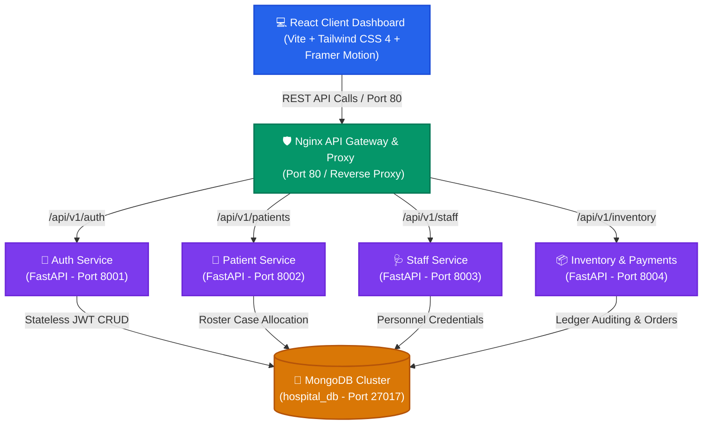
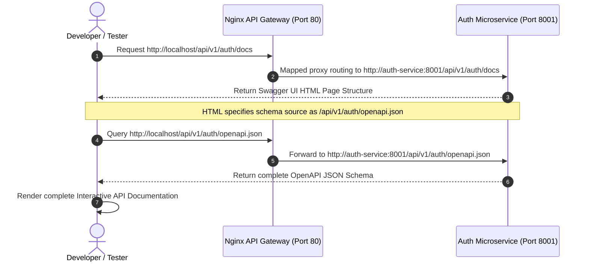

# VectorHMS: Technical Whitepaper & Architectural Reference Guide
An enterprise-grade, comprehensive guide detailing the systems architecture, data models, integration patterns, and operational logic powering the **Vector Hospital Management System (VectorHMS)**.

---

## 🗺️ 1. Global Systems Architecture & Orchestration
VectorHMS is built on a **decoupled, multi-container microservices architecture** that models modern, production-grade clinical software structures. Rather than bundling distinct hospital domains (Admissions, Rostering, Billing, Security) into a single, fragile monolithic application, VectorHMS isolates these domains into specialized service layers.

The blueprint below represents the end-to-end operational topological map, detailing how HTTP/REST payloads travel through Nginx to target specific microservice sandboxes:



### 🛡️ Why This Architecture Matters (Monolithic vs. Microservices)
In mission-critical clinical environments, software stability directly impacts operational care. In a traditional monolith, a failure in one department (such as a billing gateway failure due to a slow payment processor) can crash the entire system process, locking doctors out of patient care records.

VectorHMS avoids this through **decoupling**:
1. **Fault Isolation**: The *Inventory & Payments Service* can completely halt or crash, yet clinicians can continue admitting new emergency patients and retrieving roster schedules since those microservices run in separate, isolated processes.
2. **Stateless Scalability**: The *Auth Service* handles thousands of concurrent token validations during shift changes. Because it is stateless, multiple instances of the Auth service can be run in parallel behind the Nginx load balancer without needing to duplicate or scale the rest of the clinical databases.
3. **Targeted Deployment**: We can roll out patches, features, or database schema changes to the *Inventory Service* without restarting, rebuilding, or risking the uptime of other operational rosters.

---

## ⚙️ 2. Core Service Directory & Technical Stack

VectorHMS uses a modern technology stack specifically curated for high execution speed, strict type validation, and premium aesthetics:

### 🐍 Backend Microservice Layer

Each microservice is built using **Python** and the **FastAPI** ASGI framework, running in independent Docker containers.

* **FastAPI (`0.110.0`) & Uvicorn (`0.28.0`)**: FastAPI executes operations asynchronously using Python’s native `async/await` syntax, allowing the server to handle concurrent I/O queries (e.g. database reads) without blocking the thread. Uvicorn acts as the high-speed ASGI web server running the process loop.
* **Pydantic (`2.6.4`) Schema Validation**: Before any query is executed by MongoDB, Pydantic parses and strictly validates the incoming JSON body (e.g. validating email strings, enforcing positive pricing float constraints). If the schema does not match, FastAPI automatically returns a `422 Unprocessable Entity` response, keeping the database protected from corrupted records.
* **Stateless Security (PyJWT `2.8.0` & bcrypt `4.0.1`)**: Rather than saving server-side sessions, the system uses stateless **JSON Web Tokens (JWT)**. On successful login, the Auth service signs a cryptographically secure token using your unique `JWT_SECRET` and the `HS256` hashing algorithm. Password storage is secured using `bcrypt`’s computationally intensive key derivation function to generate cryptographically complex, salted hashes.

### 🎨 Frontend UI Layer

The interface delivers a premium **hospital operations room** design system:

* **React (`19.2.6`) & Vite (`8.0.12`)**: Operates on a modular, component-driven architecture compiled using Vite's modern hot-module replacement (HMR) bundler.
* **Tailwind CSS 4 (`4.3.0`) & Glassmorphism**: Provides styling utilizing tailored HSL color palettes, subtle grid backdrops, and blur filters.
* **Framer Motion (`12.39.0`)**: Powers dynamic page transitions, case card movement animations, and modal checkout scaling, making the portal feel premium and modern.
* **Recharts (`3.8.1`)**: Computes and displays clean, animated visual metrics on the dashboard, visualizing live hospital stock expenses and registry trends.

---

## 🍃 3. Data Design & Core Remediation Fixes

Because VectorHMS operates on a non-relational database (**MongoDB** via PyMongo `4.6.2`), traditional database joins do not exist. Instead, the data architecture utilizes **denormalized embedding and dynamic API synchronization** to maintain high read performance.

### 🐛 Critical Bug Remediation: MongoDB BSON ObjectId Serialization

During early development, a critical bug caused a server crash (`500 Internal Server Error`) when attempting to register a new clinical supply item.

#### The Problem: BSON vs. JSON
MongoDB stores documents internally in **BSON** (Binary JSON) format. When a document is inserted via PyMongo (`inventory_collection.insert_one(item_data)`), the driver modifies the input dictionary in-place by appending a primary key `_id` of type `ObjectId` (a 12-byte binary identifier). 

When FastAPI attempted to return the created `item_data` dictionary as the JSON response, Python's default JSON encoder crashed:
`ValueError: [TypeError("'ObjectId' object is not iterable"), TypeError('vars() argument must have __dict__ attribute')]`
This occurred because standard JSON does not support the binary `ObjectId` class.

#### The Solution: Stateless POP Remediation
We patched this cleanly in [main.py](file:///c:/Users/RAJESH%20PANDEY/Documents/CRT/Hospital%20Management%20System/microservices/inventory/main.py#L87-L88) by popping the `_id` from the dictionary immediately after insertion:
```python
inventory_collection.insert_one(item_data)
item_data.pop("_id", None)  # Remove the non-serializable ObjectId class reference
return {"message": "Stock Item Added", "item": item_data}
```
This leaves the local dictionary safe for standard JSON serialization, preventing server crashes while securely keeping the entry intact inside MongoDB.

---

## 🔁 4. Advanced Operational Flow Engines

VectorHMS implements two complex asynchronous synchronization engines:

### 1. Reactive Case Allocation (Patient-Staff Care Loop)

In healthcare systems, allocating clinical resources to active admissions requires real-time coordination. VectorHMS implements this utilizing a reactive, decoupled state machine:

```mermaid
sequenceDiagram
    autonumber
    actor Admin as Hospital Administrator
    participant Client as React Dashboard
    participant Nginx as Nginx API Gateway
    participant PatientService as Patient Service
    participant DB as MongoDB Cluster

    Admin->>Client: Open Staff Directory
    Client->>Nginx: GET /api/v1/patients
    Nginx->>PatientService: GET /api/v1/patients
    PatientService->>DB: Query patients where {assigned_staff_id: null}
    DB-->>PatientService: Return Unassigned Patients List
    PatientService-->>Client: Unassigned Patient List
    Admin->>Client: Choose Patient "Jane Doe" & Click "Assign Case" to "Dr. Chen"
    Client->>Nginx: PUT /api/v1/patients/{jane_doe_id}/assign
    Note over Client, Nginx: Payload: {staff_id: 1, staff_name: "Dr. Chen"}
    Nginx->>PatientService: PUT /api/v1/patients/{jane_doe_id}/assign
    PatientService->>DB: Update document where {id: jane_doe_id} setting {assigned_staff_id: 1, staff_name: "Dr. Chen"}
    DB-->>PatientService: Acknowledge Update Success
    PatientService-->>Client: Return 200 OK
    Client->>Client: State updates; Jane Doe is filtered out from Patients "Unassigned" roster
    Admin->>Client: Click "Release Case" under Dr. Chen
    Client->>Nginx: PUT /api/v1/patients/{jane_doe_id}/unassign
    Nginx->>PatientService: PUT /api/v1/patients/{jane_doe_id}/unassign
    PatientService->>DB: Update document where {id: jane_doe_id} setting {assigned_staff_id: null, staff_name: null}
    DB-->>PatientService: Acknowledge Update Success
    PatientService-->>Client: Return 200 OK
    Client->>Client: State updates; Jane Doe instantly reappears on the Patients registry
```

* **Relational Safety**: This structure achieves high-speed reads because the frontend only needs to perform a single query to display patient info, bypassing expensive database Joins. When unassigned, the patient instantly returns to the unallocated roster on the Patients panel.

---

### 2. Transparent Supply Ledger & Secure Checkout Engine

To prevent clinical billing fraud and provide audits, VectorHMS implements explicit unit pricing coupled with automated sandbox payment checkout:

```mermaid
sequenceDiagram
    autonumber
    actor Admin as Admin / Buyer
    participant UI as React Client
    participant Proxy as Nginx API Gateway
    participant Inv as Inventory Service
    participant RP as Razorpay API / Sandbox
    participant DB as MongoDB Cluster

    Admin->>UI: Enter Item "Suture Pack", Price "₹120" & Click Register
    UI->>Proxy: POST /api/v1/inventory (price: 120)
    Proxy->>Inv: POST /api/v1/inventory (price: 120)
    Inv->>DB: Insert document in "inventory" collection
    DB-->>Inv: Saved successfully
    Inv-->>UI: Return 200 OK with Item JSON
    Admin->>UI: Select quantity to "5" (Subtotal = ₹600)
    Admin->>UI: Click "Buy Stock"
    UI->>Proxy: POST /api/v1/inventory/order/create
    Note over UI, Proxy: Payload: {item_name: "5x Suture Pack", amount: 600}
    Proxy->>Inv: POST /api/v1/inventory/order/create
    Inv->>RP: Create Razorpay Order
    RP-->>Inv: Return Order ID (e.g., order_mock_abc123)
    Inv->>DB: Save pending transaction in "orders" collection
    Inv-->>UI: Return Order ID + Razorpay Public Key
    UI->>UI: Initialize checkout modal (Mock Overlay or Real SDK)
    Admin->>UI: Complete Simulated sandbox payment successfully
    UI->>Proxy: POST /api/v1/inventory/order/verify
    Note over UI, Proxy: Payload: {order_id, payment_id, signature}
    Proxy->>Inv: POST /api/v1/inventory/order/verify
    Inv->>Inv: Cryptographically verify digital signature
    Inv->>DB: Update order status to "paid" in "orders" collection
    Inv-->>UI: Success confirmation
    UI->>UI: Dynamic reload; "5x Suture Pack - ₹600" is added to verified ledger list
```

---

## 🔀 5. Nginx Proxy Gateway & Dynamic Swagger Docs Mapping

A core challenge in deploying microservices is managing client network routing. If the React application had to communicate with each service on its respective container port (`8001`-`8004`), it would run into strict browser **CORS (Cross-Origin Resource Sharing)** restrictions and firewall blocks.

VectorHMS solves this by routing all requests through **Nginx (running on standard HTTP Port 80)**, which acts as a secure reverse-proxy API Gateway.

```nginx
# global CORS headers configuration helper in Nginx gateway
add_header 'Access-Control-Allow-Origin' '*' always;
add_header 'Access-Control-Allow-Methods' 'GET, POST, OPTIONS, PUT, DELETE' always;
add_header 'Access-Control-Allow-Headers' 'DNT,User-Agent,Content-Type,Authorization' always;
```

### ⚡ Troubleshooting the Swagger 404 Proxy Bug

By default, FastAPI generates its interactive Swagger UI documentation at `/docs` and queries the underlying schema at `/openapi.json`. 

However, since Nginx is configured to only forward paths starting with their prefix (e.g. `/api/v1/auth`), requesting `http://localhost/api/v1/auth/docs` failed with a `{"detail":"Not Found"}` 404 error because the internal FastAPI service did not know it was supposed to listen under `/api/v1/auth`.

We solved this cleanly by dynamically customizing the `docs_url` and `openapi_url` parameters directly inside the FastAPI constructors in each service:

```python
# Mapped Swagger UI paths in microservices/auth/main.py
app = FastAPI(
    title="VectorHMS Auth Service",
    docs_url="/api/v1/auth/docs",
    openapi_url="/api/v1/auth/openapi.json"
)
```

Nginx now routes the request seamlessly, and the Swagger UI dynamically requests the schema under the correct Nginx-proxied subpath:



---

## 📦 6. Infrastructure & Deployment Configuration

The entire stack is configured via `docker-compose.yml` to spin up a developer sandbox in a single terminal command. Here is an overview of the service parameters:

1. **`mongo` container**:
   * **Base Image**: `mongo:latest`
   * **Database Port**: `27017:27017`
   * **Persistence**: Binds container data path `/data/db` to a Docker volume `mongo-data` to prevent data loss when container instances recycle.

2. **`auth-service` / `patient-service` / `staff-service` / `inventory-service` containers**:
   * **Build Context**: Built dynamically via individual service `Dockerfile` configurations using standard `python:3.11-slim` images.
   * **Environments**: Variables are populated dynamically by forwarding the root `.env` config.
   * **Networks**: Connected securely under a closed virtual bridge network `hms-network` so they can communicate internally using DNS hostnames (e.g. `http://mongo:27017`) rather than exposed IP vectors.

3. **`nginx-gateway` container**:
   * **Base Image**: Custom built Nginx wrapper.
   * **External Ports**: Exposes port `80` to route incoming API requests safely to their targeted microservice container instances based on route parameters:
     * `/api/v1/auth` -> `http://auth-service:8001`
     * `/api/v1/patients` -> `http://patient-service:8002`
     * `/api/v1/staff` -> `http://staff-service:8003`
     * `/api/v1/inventory` -> `http://inventory-service:8004`

---

## 🎓 Project Presentation Cheat Sheet

To help you present this project confidently during reviews, interviews, or panels, study these key scenarios:

### ❓ Question 1: "Explain how you structured your database schema and handled object relations in a non-relational database like MongoDB."
* **Answer**: "We leveraged MongoDB for its dynamic schema flexibility, allowing clinical profiles to evolve without complex migration downtime. Instead of complex SQL Joins, we designed **implicit referencing**. For example, the *Patient* record holds the `assigned_staff_id` and the staff member's denormalized `staff_name`. This provides high-speed READ performance for rosters since we don't have to perform database joins. We synchronize changes in real-time via REST APIs when assignments or releases are made."

### ❓ Question 2: "I notice your REST calls return 200 OK, but earlier there was a Python serialization crash on stock insertion. What caused that and how did you resolve it?"
* **Answer**: "When we perform an `insert_one(item_data)` using PyMongo, the driver modifies the dictionary in-place by adding MongoDB's default primary key `_id` of type `ObjectId`. When FastAPI receives the dictionary to return to the client, the standard JSON encoder crashes because it doesn't recognize Python's `ObjectId` data type. I resolved this by popping the `_id` field from the dictionary before returning it: `item_data.pop("_id", None)`. This ensures clean JSON serialization and prevents server crashes."

### ❓ Question 3: "How are the interactive Swagger Docs routed, and how did you solve the 404 proxy mapping issue?"
* **Answer**: "By default, FastAPI hosts the Swagger UI at `/docs` and queries the JSON schema at `/openapi.json`. However, since Nginx only proxies requests starting with `/api/v1/{service}`, visiting `http://localhost/api/v1/{service}/docs` was failing with a `404 Not Found` inside the container. I resolved this by explicitly configuring the `docs_url` and `openapi_url` inside the FastAPI constructor to match the microservice prefix (e.g. `docs_url="/api/v1/auth/docs"`). Nginx now routes the request seamlessly, and Swagger queries the schema under the correct mapped path!"

### ❓ Question 4: "Why use Nginx as a reverse proxy gateway instead of just calling each service port directly from the React client?"
* **Answer**: 
  1. **Single Entry Point**: The frontend only needs to connect to port `80`. This makes production deployment simple because we only have to open a single port to the public.
  2. **Security & Hiding**: All internal service ports (`8001`-`8004`) remain closed to the public internet, protecting them from unauthorized attacks.
  3. **CORS Management**: Nginx dynamically appends CORS standard headers (`Access-Control-Allow-Origin`) globally. This prevents microservices from throwing CORS errors in the browser when making API calls.

### ❓ Question 5: "How does the system ensure data consistency if the database connection drops temporarily?"
* **Answer**: "Pymongo natively supports **Connection Pooling**. When a microservice container starts up, it initializes a client connection pool. If a temporary network hiccup occurs, the driver catches the exception and retries the connection automatically before throwing an error. Furthermore, because each service is built state-free, they can be safely restarted or scaled down without losing session variables, as all persistent states are delegated securely to the MongoDB database layer."
